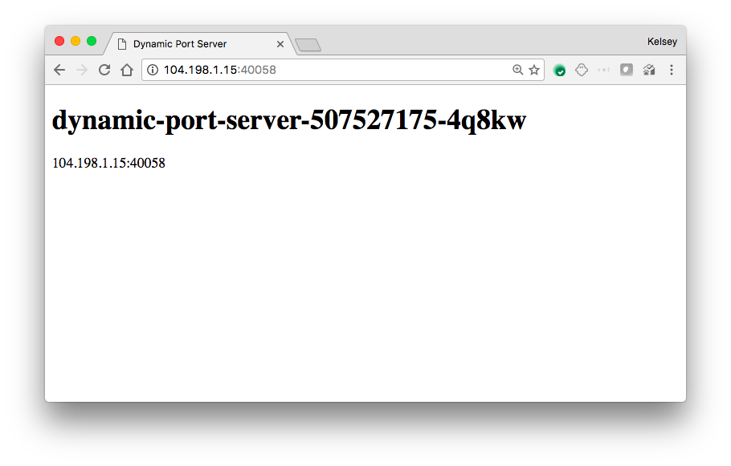
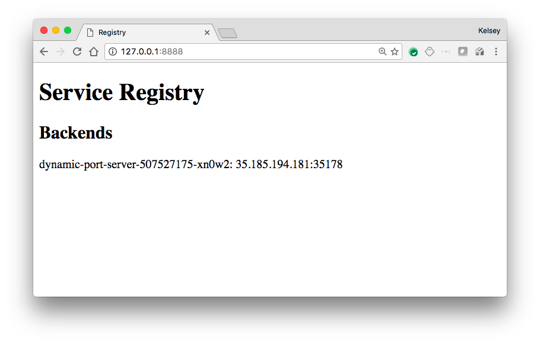
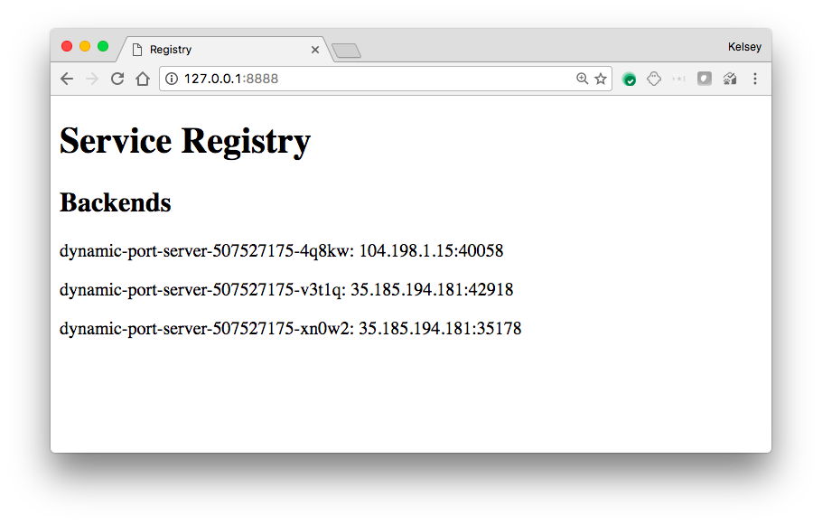

# Dynamic Ports on Kubernetes

This tutorial will walk you through running pods using dynamic ports. This is a specialized use case and should only be used in very rare cases. If you gotta ask, then you probably don't need this.

* Allocate a dynamic port per pod
* Bypass Kubernetes built-in service discovery

The example applications provide an example way to do this.

### Service Registry

The service registry provides a centralized registration service where applications can post their endpoint information. Each service record includes the following information:

* Unique service instance name (dynamic-port-server-507527175-5bphp)
* Service address (10.240.0.2:52238)

Create the `service-registry` deployment:

```
kubectl create -f deployments/service-registry.yaml
```

Expose the `service-registry` service:

```
kubectl expose deployments service-registry --type=LoadBalancer --port 80
```

At this point applications can register their endpoints.

### dynamic-port-server

The `dynamic-port-server` starts a basic web server on a dynamic port and registers with the `service-registry`.

Create the `dynamic-port-server` deployment:

```
kubectl create -f deployments/dynamic-port-server.yaml
```

Review the `dynamic-port-server` logs:

```
kubectl logs $(kubectl get pods -l app=dynamic-port-server \
    -o jsonpath='{.items[0].metadata.name}')
```

```
2017/02/03 20:37:34 Starting dynamic port server...
2017/02/03 20:37:34 Listening on 0.0.0.0:43800
2017/02/03 20:37:34 Registering advertised endpoint [35.185.194.181:43800]
35.185.194.181:34724 - - [Fri, 03 Feb 2017 20:37:38 UTC] "GET /healthz HTTP/1.1" Go-http-client/1.1
...
```

At this point the `dynamic-port-server` is registered with the `service-registry`. You can now hit the `dynamic-port-server` on the advertised address.




### The Service Registry UI

The `service-registry` exposes as basic web UI listing the registered backends. Connect to the `service-registry` UI:

```
kubectl port-forward \
  $(kubectl get pods -l app=service-registry \
    -o jsonpath='{.items[0].metadata.name}') \
  8888:80
```

Visit http://127.0.0.1:8888





Add more `dynamic-port-server` backends:

```
kubectl scale deployments dynamic-port-server --replicas=3
```

Refresh the `service-registry` UI:


